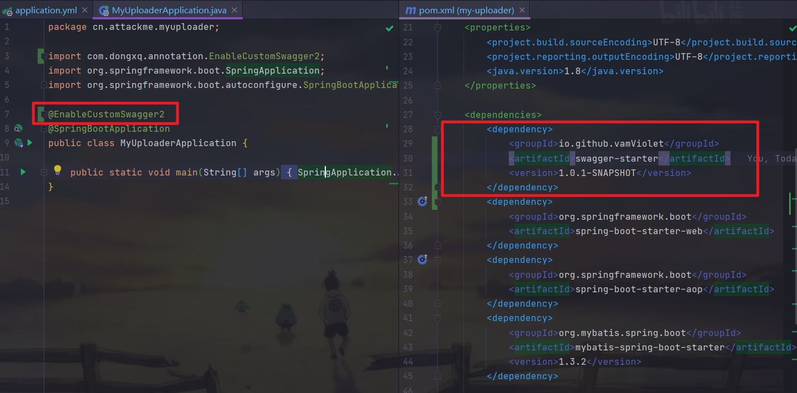
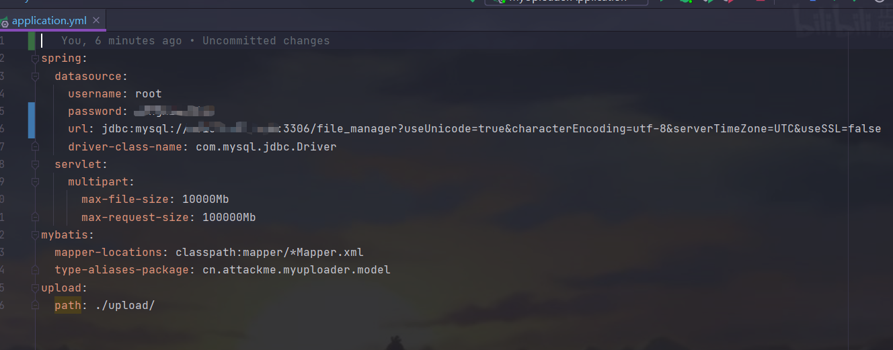
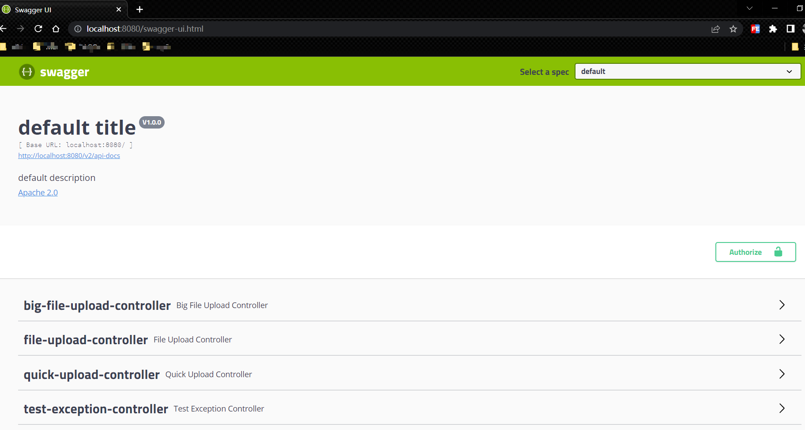

# swagger集成组件

#### 介绍
通过注解方式实现springboot集成swagger-ui功能

#### 技术栈
springboot + spring-context + springfox-swagger2

#### 依赖坐标
```
    <dependency>
        <groupId>io.github.vamViolet</groupId>
        <artifactId>swagger-starter</artifactId>
        <version>1.0.1-RELEASE</version>
    </dependency>
```

#### 自定义配置(可为空)
```
    #是否启用swagger，默认：true
    swagger.enabled=true
    #标题，默认：default title
    swagger.title = 标题
    #描述信息，默认：default description
    swagger.description = 描述信息
    #版本，默认：V1.0.0
    swagger.version = 版本
    #联系人名称，默认：""
    swagger.contact.name = 联系人名称
    #联系人url，默认：""
    swagger.contact.url = 联系人url
    #联系人邮箱，默认：""
    swagger.contact.email = 联系人邮箱
    #忽略路径，英文逗号分隔，默认：""
    swagger.excludePath[0] = 忽略路径，英文逗号分隔
```

#### 说明

1. 需要在客户端的启动类上添加注解[EnableCustomSwagger2]以集成swagger
2. 需要在客户端的配置文件中配置自定义的swagger相关信息，**<font color ="dd00dd">可为空</font>**，默认效果如下图。比如：tittle，description，包扫描路径（basePackage:默认所有，可为空）等

#### 配置及效果信息展示



