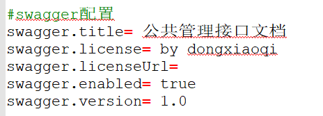

# swagger集成组件

#### 介绍
通过注解方式实现springboot集成swagger-ui功能

#### 技术栈
springboot + spring-context + springfox-swagger2

#### 说明

1. 需要在客户端的启动类上添加注解[EnableCustomSwagger2]以集成swagger
2. 需要在客户端的配置文件中配置swagger相关信息。比如：包扫描路径（basePackage）
#### 配置信息截图

